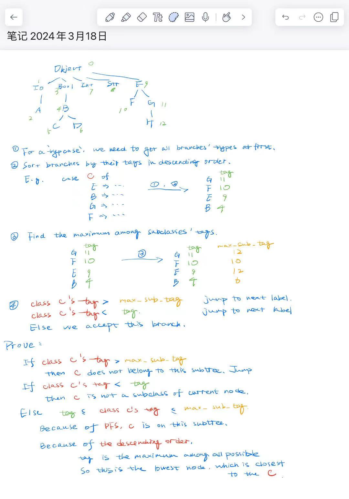

### PA1

How to use the semicolon legally?
---
1. In a "{}"block, every sentence should end with a semicolon. For example: `let s : Int in {};` or `while loop {} pool;`
2. A sentence ends without semicolon can be used as return value, but there are some restricitions:
- Only "one" sentence in the "block" and it is not in a "{}".
```cool
-- Invalid
func() : Bool {
	-- two sentences in the "block", put them in one block.
	i <- i + 1;
	if i = 0 then {
		-- only one sentence in the "block", but in a "{ }"
		false;
	} else
		-- only one sentence in the block and not in a "{ }". So legal.
		true
	fi
};
-- valid
func() : Bool {
	{
		i <- i + 1;
		if i = 0 then {
			false;
		} else
			true
		fi;
	}
};

```

### PA2

- How to solve `undefined reference to 'yywrap'`
  - yywrap() is used for dealing with multiple input sources.
  - When the input is used out, the yywrap is invoked to decide whether lexer continues to scan.
  - If it returns a non-zero value, the lexer stops.
  - Add `int yywrap() { return 1; }`

- Use `lexer assignments/PA1/stack.cl` to see the output.
  - `which lexer` should show something like 'bin/lexer'.  

- In the rule section of flex
  - /* can't be unindented.
  - between '|', don't add extra space. `Int | Bool <- Wrong! Int|Bool <- Correct!`
  - Ref. Flex12 to see how to judge EOF. Don't use feof(fin) which is wrong.

- Start condition is useful.
	- When handling <str>, it is tricky that `<str>\0` can't detect the null character.
		- Because `<str>[^\\\n\"]+` will absorb `\0`.
		- So we must replace it with `<str>[^\\\n\"\0]+`.
		- However, it will trigger a more tricky problem: how to handle the rest string.
		- The idea is from others, by using `yymore()` and `yyleng`.

Summary
---
- Overall, in this part, we generally see the result of the lexical analysis.
- We learn the different kinds of token. Each token is a pair of `<TOKEN_CLASS, lexeme>`. They are stored in tables, which will be used in later steps.
- We know the comment is ignored in this step.
- Some errors can already be detected by this step. For example, the unmatch of the comment signature, the invalid character, the string with an unescaped newline. 
- Behind the flex, we shouldn't forget that the implementation of lexical analysis: **Rexp =>NFA=>DFA=>Code**. (The code contains the corresponding DFA actually.

### PA3

- For fun, play an example from the bison manual. Use it with flex.
	1. Make sure that all characters are handled appropriately by flex.
	2. Can define token or just return the origin character for convenience.(e.g `\^	{ return '^'; }`)
	3. To extend the type of yylval, add `#define YYSTYPE double extern YYSTYPE yylval;` before `#include "calc.tab.h"`
		- Using union is more	robust.
		- [See here](https://zhuanlan.zhihu.com/p/143867739)
	4. In `calc.y`, `extern int yylex()` so that it can work together.
	5. Done.
	6. Use `make` to compile them.
		- `make` Revision
		- It's not necessary to remember the meaning of some abbreviations like `$<`. Because it's easy to forget and hard to maintain.
		- First, Set some variables. (e.g CC, CFLAGS, SRC)
		- Secondly, figure out their dependencies.
		- Lastly, write some phony targets like *clean*.
- Some details about bison
	- e.g. `expr: expr '+' expr';' ;`
		- The location of the whole grouping is `@$`, while the locations of the subexpressions are `@1` and `@3`.
		- The value of the whole grouping is `$$`, while the values of the subexpressions are `$1` and `$3`.
	- Use left recursion for space.
- Some details about writing PA3
	- Ref. `cool-tour.pdf` / `coor-manual.pdf figure1`(very useful)
		- `cool-manual.pdf Section 11.1 Precedence`
	- Constructors -> Ref. `cool-tree.aps`, `cool-tree.h`
	- Do we need to use `stringtable.add_string()...`?
		- No, we have already use it in `cool.flex`.
		- Except for `ID()`, it means `self.ID()` actually. So `add_string('self')` to return a symbol.
	- A simple and useful strategy is simply to skip the rest of the current input line or current statement if an error is detected.
	- By default, it sets the beginning of @\$ to the beginning of the first symbol, and the end of @\$ to the end of the last symbol.
		- When practicing, @\# can be used as an integer.
		- When meetting the empty rule, i don't know how to set the line number of it. It returns something like #-1073741822.
		- So i reduce the use of empty rule, which causes more shift-reduce conflicts.

Summary
---
- Parser has two targets:
	1. Accept or reject if there are some errors being detected.
	2. Generate an AST.
- The unconfortable syntax makes the parse easier.
	- The if statement must be matched with a else statement. So we don't care about their precedence. 


### PA4

- The operator '<<' of entries is override.
- Use **Observer design pattern** to pass the error message.
	- Furthermore, use the macro *REGISTER_ERROR* to inject the error handler, which is very convenient.
- Use `using` instead of `typedef`.
	- Even can use template alias.
	- Simulate JAVA's interface which is more reasonable.
	- `template<typename K, typename V> using HashMap = std::unordered_map<K, V>;`
- When taking values from HashMap, using `at()` instead of `operator[]` which is wrong for **const** set container.
- Because of the low efficiency of `List`, we always pre-load the variable.(e.g `Class_ c = classes->nth(i); `)
	- In other word, in each loop-statement, only use `nth()` once.
- Ensure that we invoke `register_class()` and `type_infer()` on each sub expression.
- Debug the core dump
	- `ulimit -c unlimited`
	- `echo /dump/core-%e-%p-%t > /proc/sys/kernel/core_pattern`
	- `sudo mkdir dump`
	- `chown tyz /dump && chgrp tyz /dump` or `chown tyz.tyz /dump`
	- `cgdb ./semant /dump/core-semant-723101-1709786082`
	- First, use core dump to locate where the error happens.
	- Then, debug `cgdb ./semant` to find the error.
		- `lexer grading/...cl | parser > test.txt` to make the AST
		- `cgdb ./semant` enter the gdb
		- `b main` `b dispatch_class::type_infer` set the breakpoint according to the core dump
		- `r < test.txt`
		- `c`
		- Use print statement and etc.

Summary
---
- In this part, we have done **semantic analysis**.
	- We apply the type check so that there won't have type errors at runtime.
	- We also check some low-level errors.
		- All classes should be defined and defined only once.
		- There is no inheritance cycle.
		- Attributes defined in a class should be defined only once and not be defined in its parents' classes.
		- Methods can be override, but with the same parameters.
		- The use of *self* is reasonable.
		- etc.
- At this point, we have done the front-end of the compiler. Almost all compiler-time errors have been detected.


### PA5
- First, take a look at `lexer example.cl|parser|semant|cgen`
- Because the style of source code is too bad, use `clang-format`
	- `clang-format --style=llvm --dump-config > ./.clang-format`
	- `clang-format -i <file>`
- `Class_nameTab` a table, which at index (class tag) ∗ 4 contains a pointer
to a String object containing the name of the class associated with the class tag
	- Used for `dispatch`
- `Class_protObj` defines some basic infos about Class. For the attributes, assign it with anything reasonable.
	- Used for `new SELF_TYPE`
- When designing the interface, there are many trade-offs.
	- E.g. we can do a thing in one pass which is more efficient. However, they are two different things
	which is more clear when we seperate them. For me, i prefer the second one even we will lose some of the 
	efficiency.
- The generation of the code is not efficient, so simple.
	> KISS: keep it simple and stupid
	- No use of extra s-registers, so unnecessary to pass the register set to maintain.
	- Don't care about whether the current procedure is the leaf procedure. Maintain RA **anytime**.
- For the interface of the `code`, i decide to pass two parameters:
	1. `SEnv o_pos`
		- Records all temporary variables defined in let, case expr.
	2. `int temp_index`
		- Allocate in advance temp_index * WORD_SIZE space above the FP.
		- This space is used for temporary varialbes.
	3. `CgenNodeP node`. Very useful, find the CgenTable, sub_maxtag...
	4. `MEnv m_pos` to find the method's index at `Class_nameTab`.
	5. `ostream &s`
- Debug
	- Use spim to debug(Not recommended)
		- `read "/home/tyz/Desktop/Projects_abroad/CS143/assignments/PA5/test.s"`
	- Read Documentation again and check the code.
	- Read the .s generated by `coolc`.
- How to write **Typcase**?
	- Learn from `coolc`
	- Tag must be distributed by the hierarchy of inheritance.
	- DFS to decide the tag.
	- 
- `HashMap<Symbol, int> m_pos` and `std::vector<std::pair<Symbol, Symbol>> method_layout`, ALL O(1) op.
	- m_pos records methods' names and their offsets.
	- method_layout records methods' names and their owners.
	- method_layout is a vector for the print.
	- m_pos is a HashMap for search the index.
	- When we want to change the owner, we just `method_layout[m_pos[m_name]].second = ...`
	- Each op is efficient.
- loop returns void: `emit_move(ACC, ZERO, s);`
- String.substr requires the parameter to be put in the reverse order.
	- This limits the formal's layout.
	- So we need to change the layout so that we use FP + (n - i) * WORDSIZE instead of FP + i * WORDSIZE to get the ith parameter.

		- We get this by using 

Summary
---
- The grading script is wrong. Write a `test.py`.
	- Use `generate_res()` to generate the correct answer.
	- Use `test()` to compare.
- Now we finish the back-end of the compiler.
	- However, this part does not involve the intermediate code generation and the optimization.
	- We generate the MIPS code directly.
	- Use stack machine model. Only use one s-register.
- **MIPS** resembles **RISC-V**
- We need to debug by using different tools and different methods.
	- cgdb, core dump, test...
